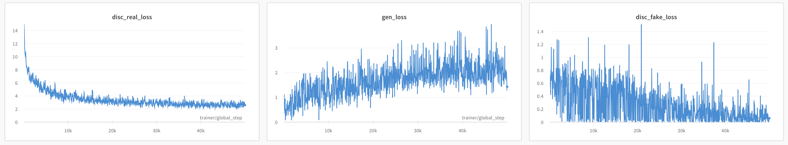

# Towards Faster and Stabilized GAN Training for High Fidelity Few-shot Image Synthesis

Implementation of FastGAN from https://arxiv.org/abs/2101.04775.

### Dataset

Few-shot images dataset from default configuration is automatically downloaded from http://silentz.ml/few-shot-images.zip. In case domain has expired, you can download archive manually and unpack it to `data/` directory inside project root. _NOTE: you can download few-shot-images.zip from github releases of this repository_. Final `data/` directory layout should look like this:

```
data/
├── few-shot-images
│   ├── anime
│   ├── art
│   ├── cat_faces
│   ├── dog_faces
│   ├── grumpy_cat
│   ├── moongate
│   ├── obama
│   ├── panda
│   ├── pokemon
│   ├── shells
│   └── skulls
└── few-shot-images.zip
```

### Training losses

`gen_loss` - generator loss

`disc_real_loss` - discriminator loss on real images

`disc_fake_loss` - discriminator loss on images from generator



### How to reproduce

1. Clone repository:
```bash
git clone https://github.com/silentz/Towards-Faster-And-Stabilized-GAN-Training-For-High-Fidelity-Few-Shot-Image-Synthesis.git
```

2. Cd into repository root:
```bash
cd Towards-Faster-And-Stabilized-GAN-Training-For-High-Fidelity-Few-Shot-Image-Synthesis
```

3. Create and activate virtualenv:
```bash
virtualenv --python=python3 venv
source venv/bin/activate
```

4. Install required packages:
```bash
pip install -r requirements.txt
```

5. Download dataset (should be automatic, but if not, see section above).

6. Choose one of dataset configs (located in `train/configs` dir):
```
train/configs/
├── anime.yaml
├── art.yaml
├── cat_faces.yaml
├── dog_faces.yaml
├── grumpy_cat.yaml
├── moongate.yaml
├── obama.yaml
├── panda.yaml
├── pokemon.yaml
├── shells.yaml
└── skulls.yaml
```

6. Train model:
```bash
python -m train fit --config train/configs/shells.yaml
```

7. Create torchscript model:
```bash
python -m train.export --config train/configs/shells.yaml --from_ckpt checkpoints/epoch=0-step=49999.ckpt
```

8. Run inference script:
```bash
python infer.py export/shells.pt # path to exported model (see config)
```
